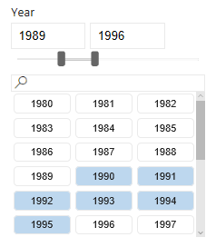

# PowerBI Slicer custom visual sample
[](https://travis-ci.org/Microsoft/powerbi-visuals-sampleslicer)

Demonstrates the use of the Advanced Filtering API introduced in the revision 1.7 of [PowerBI Visuals Tools](https://github.com/Microsoft/PowerBI-visuals-tools). 

This PowerBI Custom Visual relies on the Advanced Filter API for bulk data-point selection and [Interactivity Utils](https://github.com/Microsoft/powerbi-visuals-utils-interactivityutils) for discrete data-point selection.

### Understanding the visual
The visual lets the user select numeric data inputs to be displayed in all other visuals in the same report. The user can either select discrete values or a range by adjusting the sliders. 

See a [demo PowerBI report](doc/SampleSlicer.pbix) to get an idea about the visual's functionality.



### Setting Up Environment

Before starting creating your first custom visual follow by [this](https://github.com/Microsoft/PowerBI-visuals/blob/master/Readme.md#setting-up-environment)
setting up environment instruction.


### Install dev dependencies:

Once you have cloned this example, run these commands to install dependencies and to connect the visual into powerbi.

```
npm install # This command will install all necessary modules
```

### Start dev app
```
pbiviz start
```

### Understanding the code
1. [Code structure](doc/CodeStructure.md)
2. Discrete selection with InteractivityUtils
  - [Adding Interactivity Utils to the project](doc/AddingInteractivityUtils.md)
  - [Using Interactivity Utils](doc/UsingInteractivityUtils.md)
3. Advanced selection with Advanced Filter API
  - [Adding Advanced Filter API to the project](doc/AddingAdvancedFilterAPI.md)
  - [Using Advanced Filter API](doc/UsingAdvancedFilterAPI.md)
